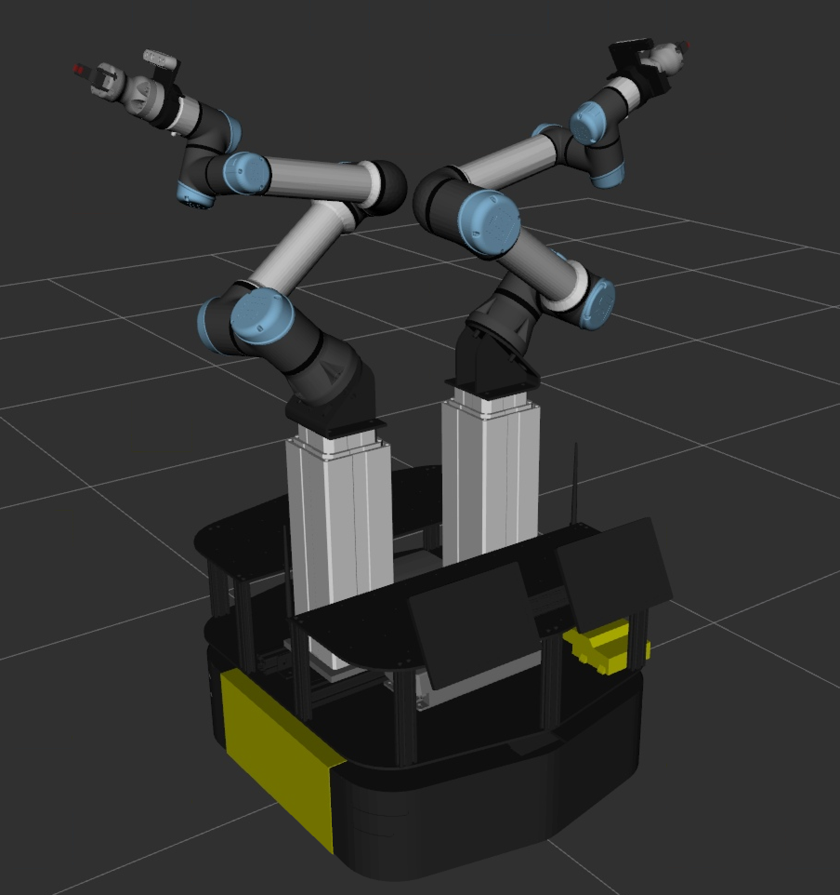

# Phoebe Bridgeback

Descriptions, deployments, tooling, and configuration files for the Phoebe Bridgeback dual arm mobile manipulation robot platform,
part of the [iMETRO Facility](https://ntrs.nasa.gov/citations/20240013956) at NASA's Johnson Space Center.
This project is intended for use in one of ER4's managed workspaces (such as the in the [phoebe_bridgeback_ws](https://github.com/NASA-JSC-Robotics/phoebe_bridgeback_ws)).

The robot includes:

* 2x UR10e serial manipulators with Robotiq Hand-E Gripper and wrist mounted RealSense RGB-D cameras
* 2x Ewellix Lifts
* A Clearpath Ridgeback mobile base



## Usage

The instructions to run the whole phoebe environment can be found in the (Docker workspace)[].
The specific launches that are useful from this repository are the following:

```bash
# run the standard control script with a kinematics simulation
ros2 launch phoebe_deploy control.launch.py platform:=mock_hardware

# run the standard control script on hardware
ros2 launch phoebe_deploy control.launch.py platform:=hardware

# for any of these launches, you can add a namespace or tf prefix
# like the following (only shown for mock_hardware). Note that these
# have not been coordinated with the moveit config yet.
ros2 launch phoebe_deploy control.launch.py platform:=mock_hardware ns:=r100_0564
ros2 launch phoebe_deploy control.launch.py platform:=mock_hardware tf_prefix:=r100_0564_
ros2 launch phoebe_deploy control.launch.py platform:=mock_hardware ns:=r100_0564 tf_prefix:=r100_0564_

# run the standard moveit config (same for all platforms)
ros2 launch phoebe_moveit_config phoebe_moveit.launch.py

# Hardware cameras launch file
ros2 launch phoebe_deploy phoebe_rspc_camera.launch.py
```
## Citation

This project falls under the purview of the iMETRO project. 
If you use this in your own work, please cite the following paper:

```bibtex
@INPROCEEDINGS{imetro-facility-2025,
  author={Dunkelberger, Nathan and Sheetz, Emily and Rainen, Connor and Graf, Jodi and Hart, Nikki and Zemler, Emma and Azimi, Shaun},
  booktitle={2025 22nd International Conference on Ubiquitous Robots (UR)},
  title={Design of the iMETRO Facility: A Platform for Intravehicular Space Robotics Research},
  year={2025},
  volume={},
  number={},
  pages={390-397},
  keywords={NASA;Moon;Seals;Maintenance engineering;Maintenance;Robots;Standards;Open source software;Testing;Logistics},
  doi={10.1109/UR65550.2025.11077983}}
```
