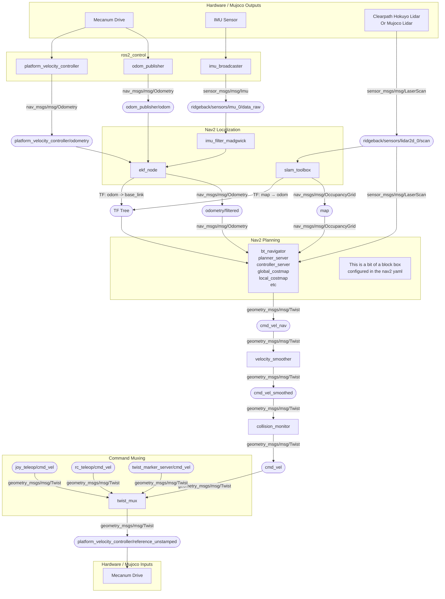

# Phoebe Nav2 Config

Phoebe comes with a basic nav2 integration that works on hardware and in the dynamic simulation.
The topics are all intended to match across systems.

## Diagram

Wiring nav2 together and figuring out where it is disconnected can be difficult.
The diagram below is a rough map of the nodes, topics, and controllers involved.
When things aren't working it should give users a rough idea of where connections are made.

